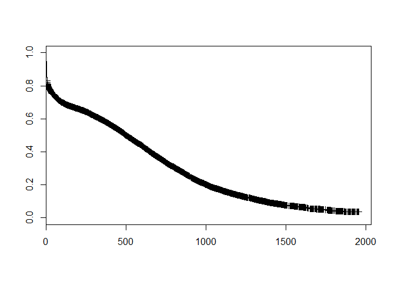

# Familiarizing Yourself with CA Tables, Connect to the Tables in R, and Make a Survival Curve
Joe Mienko  
July 20, 2015  


1. Get a sense of the placement and intake tables. The queries to do so would be 

```sql
select * 
from ca_ods.base.rptPlacement
```

and 

```sql
select *
from ca_ods.base.rptIntake_children
```

2. Try and play with a more complicated query including a join on one of our "ref-lookup" tables, `ref_lookup_ethnicity_census`. The following code is an example of such a join. As you can see, the `tx_race_census` values are identical to those used on the portal. Cross-walking these (and related values) to the birth data is what your first task will be on the RODIS study. 

```sql
select
	rlec.tx_race_census 
	,rp.* 
from ca_ods.base.rptPlacement rp
	join ca_ods.dbo.ref_lookup_ethnicity_census rlec
		on rp.cd_race_census = rlec.cd_race_census
where removal_dt >= '2010-01-01'
```
Although `select` statement is written with a `select`, `from`, `where` sequence. The actual order of operations (i.e. how SQL Server reads the statement) goes `from`, `where`, `select`. Thus, in words, the statement above is saying 

> `from ca_ods.base.rptPlacement` (which we have "aliased") to `rp` and `ca_ods.dbo.ref_lookup_ethnicity_census` which we have aliased to `rlec`

> `where` the field `rp.cd_race_census` is equal to `rlec.cd_race_census` and the field `removal_dt` is greater than or equal to `'2010-01-01'` (the first `where` condition is in the join which is basically a synonym for `where` conditions, the second `where` condition is listed seperately in the `where` clause)

> `select` `tx_race_census` from 	`rlec` and select all records from `rp` (as indicated by the `*`)
    
3. Set up an ODBC connection to the SQL Server
    + Go to Administrative Tools in the Control Panel and Select ODBC.
    + Select System DSN tab at the top.  Using the mouse, select/push the Add button.
    + Select the SQL Server data source connection type. Using the mouse, select/push the Finish button. 
    + Enter the ODBC source Name - "POC2". 
    + Use "POC" for the description. 
    + Select the desired authentication type (Windows Authentication). 
    + Select the database, `CA_ODS`
    + Using the mouse, select/push the Finish button. 
    
4. Try to connect to the database using the `RODBC` package in R. The following code gives an illustration of how this is typically accomplished. 


```r
## if not already installed, uncomment and run 
## install.packages("RODBC")

## if installed, load RODBC
library(RODBC)

#assign your ODBC connection to an object called con
con <- odbcConnect("POC")

#query the database. using a variation on the select statement
#from above, select all entries into out-of-home care who entered on 
#or after 2010-01-01

dat1 <- sqlQuery(con, "
select * 
from ca_ods.base.rptPlacement
where removal_dt >= '2010-01-01'")
```

5. Try and calculate a survival curve using the data you've pulled into `dat1`. 


```r
#load lubridate (install as needed) for date calculations
library(lubridate)
#load survival (install as needed) for survival curves and
#other event history stuff
library(survival)
```

```
## Loading required package: splines
```

```r
#calculate length of stay as of the pull of our data (runtime)
dat1$los <- ifelse(dat1$discharge_dt=="9999-12-31 PST"
                   ,difftime(dat1$runtime
                             ,dat1$removal_dt
                             ,units="days")
                   ,difftime(dat1$discharge_dt
                             ,dat1$removal_dt
                             ,units="days")
)

#calculate an exit variable to indicate exit (1) or right 
#censoring to observation (0)
dat1$exit <- ifelse(dat1$discharge_dt=="9999-12-31 PST"
                      ,0
                      ,1
)

#examine the median length of stay for our entry cohort 
dat1_sf <- survfit(Surv(los, exit)~ 1
                   ,conf.type="none"
                   ,data = dat1)

dat1_sf 
```

```
## Call: survfit(formula = Surv(los, exit) ~ 1, data = dat1, conf.type = "none")
## 
## records   n.max n.start  events  median 
##   34781   34781   34781   24310     501
```

```r
#plot the survival curve 
plot(dat1_sf)
```

 

6. It is probably helpful to walk through one of the many tutorials available online
    + http://www.ms.uky.edu/~mai/Rsurv.pdf or 
    + http://www.bio-complexity.com/QUBsscb/SSCB2012_jb.pdf
are both good starting points. 

